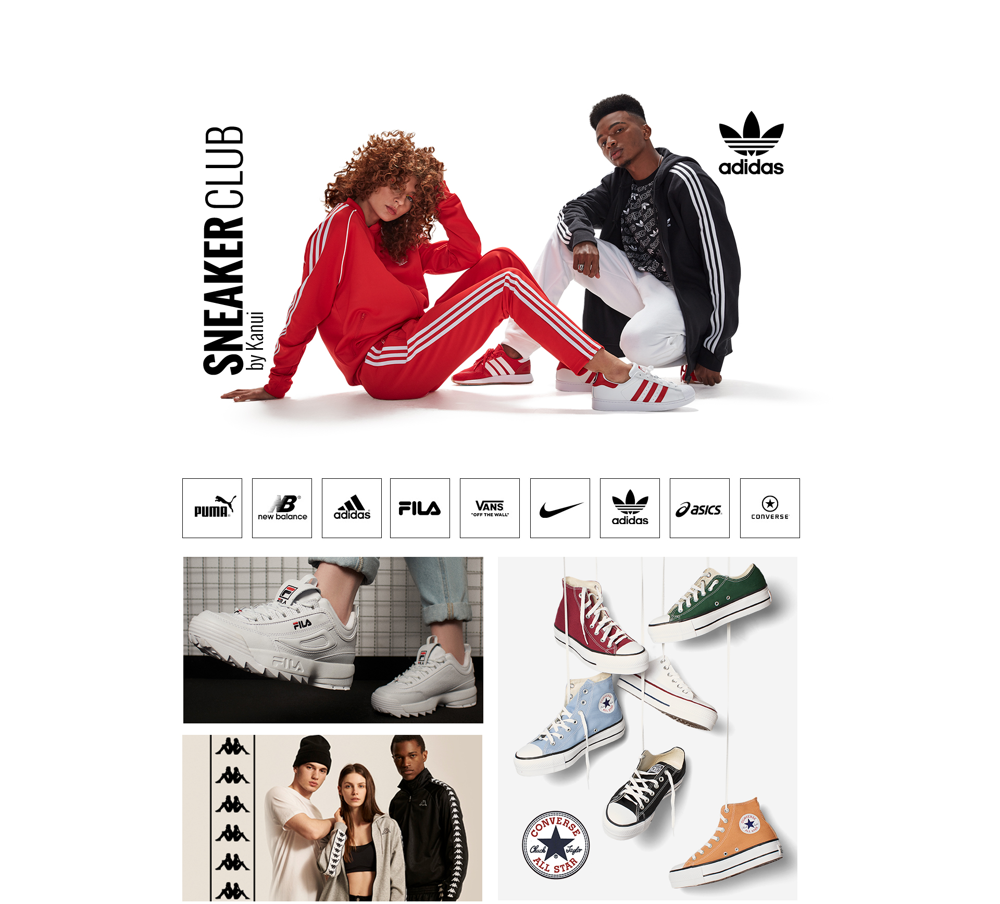

# Sneaker Club

## Sumário

- [Visão geral](#visão-geral)
  - [O Projeto](#o-projeto)
  - [Screenshot](#screenshot)
- [Links](#links)
- [Tecnologias](#tecnologias-usadas)
- [Contato](#contato)

## Visão Geral

### O Projeto

<b>SneakerClub</b> é um projeto inspirado em um dos maiores e-commerces de moda da América Latina, focada em <b>
    levar a moda
    do mundo para todo mundo
</b>
e criar a melhor <b>plataforma</b>
para marcas e sellers.  
 Com um design moderno e responsivo que oferece aos usuários uma experiência de navegação agradável e intuitiva. Aqui estão as principais funcionalidades e características do projeto:

### Barra de Navegação de Produtos com Setas Laterais

- A página possui uma área de exibição de logos de diversas marcas, onde os usuários podem navegar utilizando setas laterais (esquerda e direita). As setas permitem que o usuário explore diferentes produtos ou marcas de forma dinâmica.

### Banners de Promoções e Coleções:

- Abaixo da seção de navegação, a página exibe banners de promoções e coleções específicas, cada um com uma imagem representativa, um título e uma breve descrição. Esses banners são organizados em duas seções: banners menores e um banner maior, proporcionando destaque para ofertas especiais.

### Design Responsivo:

- O layout é cuidadosamente projetado para ser responsivo, adaptando-se a diferentes tamanhos de tela e dispositivos, incluindo smartphones, tablets e desktops. Isso é alcançado através do uso de media queries no CSS e imagens específicas para diferentes resoluções.

### Transições e Efeitos:

- As imagens e botões possuem transições suaves e efeitos de hover, melhorando a interatividade e a experiência do usuário.

### Compatibilidade entre Navegadores:

- O projeto utiliza técnicas de compatibilidade entre navegadores, como vendor prefixes e fallbacks, para garantir que a experiência seja consistente em diversos navegadores populares.

### Screenshot

## Links

- Repositório: https://github.com/mazziera/sneaker-club

- Deploy: https://mazziera.github.io/sneaker-club/

## Tecnologias usadas

- <b>HTML5:</b> Para a estruturação semântica da página.
- <b>SEO:</b> Para  melhorar a visibilidade e o ranking do site nos resultados de pesquisa orgânica em mecanismos de busca.
- <b>CSS3:</b> Para estilização, incluindo Flexbox e media queries para responsividade.
- <b>JavaScript Vanilla:</b> Para a interatividade e dinamismo da navegação de produtos.
- <b>Visual Studio:</b> IDE utilizada como ambiente de desenvolvimento da aplicação.
- <b>Git:</b> Sistema de controle de versão, utilizado para o gerenciamento do código do projeto.

## Contato

- Github - [mazziera.io](https://github.com/mazziera)
- Linkedin - [@raphael-mazzieri](https://www.linkedin.com/in/raphael-mazzieri/)